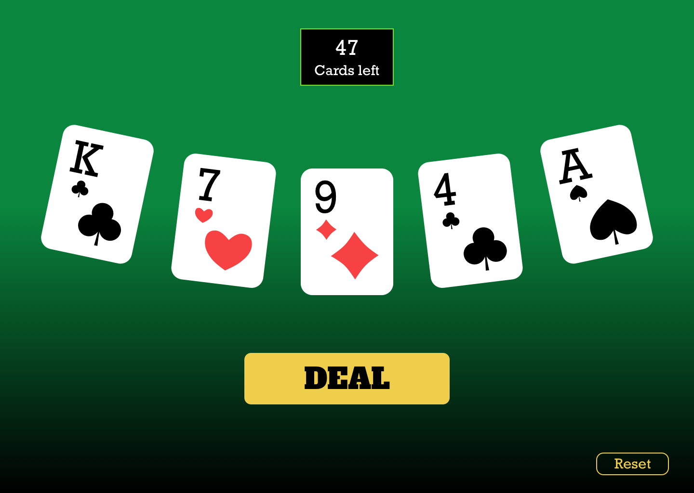
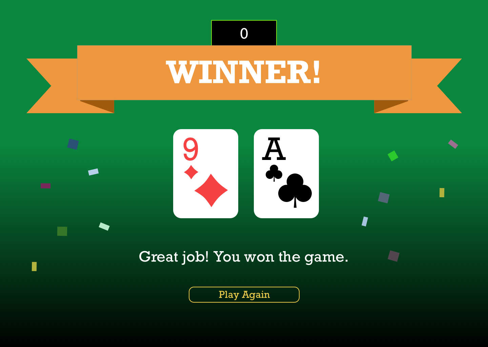

# Uplift Interview

Welcome!

## Intro

This repository contains the Uplift coding "challenge", if you can call it that.
We believe in letting you work as freely as you want within the constraints of
this setup. Our goals are to assess:

- that you can follow specs/requirement docs, making pragmatic decisions along the way
- your level of expertise (mid-level=good approach, expert level=teach us something we don't know)

## Table of Contents

1. [Challenge criteria](#challenge-criteria)
1. [General instructions](#general-instructions)
1. [Frontend challenge](#frontend-challenge)
1. [Backend challenge](#backend-challenge)
1. [Backend challenge: node](#backend-challenge-node)

## Challenge criteria

- overall architecture and code quality (readability, decoupledness, etc)
- file structure
- naming
- test coverage (see instructions for [running tests](#running-tests))
- proficiency

If you wish to work full-stack, please attempt both frontend and backend.

## General instructions

- Please note there is a shared `.env` file for environment variables. This file is used by
  frontend and backend.
- Please lint and explain your code (even just briefly). CI runs checks, you can see them in `.github/workflows`
- After completing the challenge to a level that you're satisfied shows off your expertise,
  open a pull request against master (open two separate ones if you're doing frontend + backend)
- In your PR add a description explaining anything you think is worthwhile, summarizing
  your approach.
- The repo uses CI to run tests and lint checks on your PR. We'd like to see those passing.

## Frontend challenge

The task is to build a simple card game. See [design folder](./design) or [Sketch Cloud](https://www.sketch.com/s/40cd1ec0-8487-4053-a6ea-5d9a70076ebb) for what it should look like. It doesn't have to be pixel perfect, but it should look nice.

The program should perform the following functions.

1. Assuming a standard deck (52 cards of 4 suits: ♣ Clubs, ♦ Diamonds, ♥ Hearts, ♠ Spades).
2. Press a "Deal" button to deal 5 random cards.
3. Pressing the button again should deal 5 unique, random cards. Within the same game, you should never get the same cards again that you got in the past (just like a physical deck).
4. Add a card counter which shows how many cards are dealt/left.
5. Add a button to reset the game.
6. When all the cards have been dealt, Game Over should be displayed.
7. If there is an ace in the last draw, display You Win, otherwise display You Lose, Sucker.
8. Bonus: Animations. Wow us!

Requirements:

- React
- Tailwind

Please write tests.

Feel free to use any additional libraries.

[Example implementation.](https://drive.google.com/file/d/1uIYhG-74wrWs7YZx6Zz9Bdn3WSEtaIWY/view?usp=sharing)

### Troubleshooting & Tips

If you have any issues with husky/commit hooks, you may remove the \*.py section of "lint-staged" in package.json

### Design





### Requirements

- Node 12+ (tested on 12.3.1)
- Yarn 1+ (tested on 1.16.0)

### Getting Started

    yarn install

Then:

    yarn start

Your browser will automatically open to http://localhost:3000 by Create React App. Changes should be reflected automatically.

See [CRA documentation](https://facebook.github.io/create-react-app/).

## Backend challenge

**TL;DR (but please, read on): backend version of the frontend card game.**
Use Django (v3+), graphene (v2+), and a SQL database (postgres, for migrations).

Session, auth or login are all optional, but clean implementations earn points.

1. Assuming a standard deck (52 cards of 4 suits: ♣ Clubs, ♦ Diamonds, ♥ Hearts, ♠ Spades).
2. Press a "Deal" button to deal 5 random cards.
   - Make this a mutation
3. Pressing the button again should deal 5 unique, random cards. Within the same game, you should never get the same cards again that you got in the past (just like a physical deck).
   - Same mutation.
   - For storing data/state, any clean solution goes if you wanna focus on other parts.
4. API for a card counter which shows how many cards are dealt/left.
5. API to reset the game.
6. API to show the game is over.
7. API for win/lose. If there is an ace in the last draw, display You Win, otherwise display You Lose, Sucker.
8. Unit tests.
9. Bonuses:
   - Streak of wins/loses/games played in <period> (can be the last hour, but should be configurable)
   - Storing user details, login/out
   - Rig the game (e.g. player always wins)
   - Custom deck support (e.g. other deck images, other lengths of decks, not just 52 cards)

You can implement your own database architecture (models) and your own GraphQL schema. You do not have to copy the playground schema (mentioned below), although you can use it for inspiration.

You also don't need to implement authentication (although you are welcome to, if you prefer). You can fake it at the middleware level, or log in to the Django admin and send subsequent requests with the session information set by Django.

Feel free to use any additional libraries.

You can run a sample query at http://localhost:5000/graphql/

```graphql
query {
  me {
    username
    email
  }
}
```

### Getting started

On MacOS, use [brew](https://brew.sh/) to manage installation of supporting programs, as it keeps things tidy.

For backend, the recommended way is to use poetry and pyenv. All of the commands in this section are from the `server` folder.

You may also work in docker, using the provided `./docker-assist` and `docker-compose.yml`, but it's generally quicker to develop locally. See `docker/Docker.server/Dockerfile` for the docker setup, and note that poetry is set up to export to `requirements.txt`.

Install [poetry](https://python-poetry.org/). To manage python versions, we recommend installing [`pyenv`](https://github.com/pyenv/pyenv). See [the `poetry` documentation](https://python-poetry.org/docs/managing-environments/) for details.

Then install Python dependencies:

    cd server/
    # try one of these
    pyenv install 3.9.4  # or pyenv local 3.9.4
    poetry env use ~/.pyenv/versions/3.9.4/bin/python
    poetry install
    # or
    poetry install --python `which python3`

If you don't have it already, you'll also want to install Postgres. Version 10 or later should be fine.

If you have issues:

- Check which pyenv version homebrew installs https://github.com/Homebrew/homebrew-core/blob/master/Formula/pyenv.rb#L4
- See what versions of python that pyenv version supports: https://github.com/pyenv/pyenv/tree/v1.2.19/plugins/python-build/share/python-build

Copy example env vars to `.env`. You might need to change `DATABASE_URL` based on your environment.

    cp ../.env.example ../.env

Create the `uplifty` database:

    createdb uplifty

Load the sample user data:

    poetry run ./manage.py migrate
    poetry run ./manage.py loaddata uplifty/fixtures/users.json
    poetry run ./manage.py runserver 5000

Now you can go to http://localhost:5000, http://localhost:5000/graphql/, or http://localhost:5000/admin/ for the Django admin.

Log in to the admin with the [sample test user](#sample-test-user) from below and try the sample query from the challenge.

### Installing packages

```
poetry add <package name>  # this automatically adds it to pyproject.toml and poetry.lock
```

If you manually update `pyproject.toml`, make sure you run `poetry update` to update the lockfile.

### Running tests

Please run the tests, and lint your backend code. This helps us review code, as it's already consistent with this project.

```
yarn autoflake
yarn pytest:fresh
```

Or check out `package.json` for other options.

### Server architecture

- PostgreSQL 10+
- Python 3.9+
- Django 3
- [django-environ](https://github.com/joke2k/django-environ) for easy environment configuration via `.env` files

### Sample test user

The database is created with a sample test user:

| Name     | Value                   |
| -------- | ----------------------- |
| Username | interview               |
| Email    | interview@uplift.agency |
| Password | uplifty                 |

You can change these in the Django admin if you wish.

## Backend challenge: node

If you are working with node instead of Django, we'd like you to do the same backend challenge with TypeScript and GraphQL.

There is a starter server you can use in `node-server/`, and it runs CI using `.github/workflows/backend_node.yml`. Please make sure the build passes.
